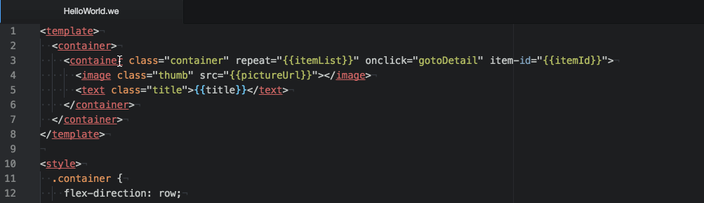
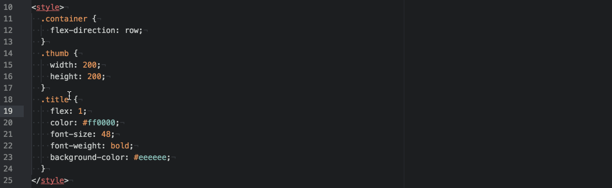
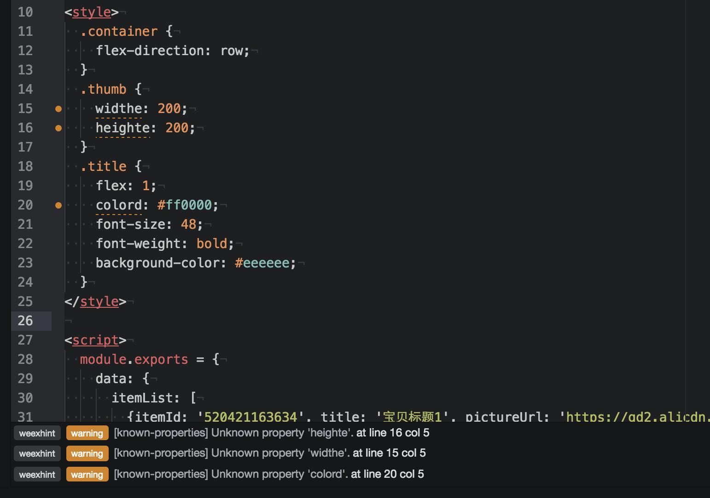

# Overview
### Linter for THERA
Weex

### Linter in action

# Lint support
1. WEEX Tag DSL
2. CSS style
3. JS Language lint support

### Linter WEEX-tag

### Linter for CSS

### Linter at Status Bar

